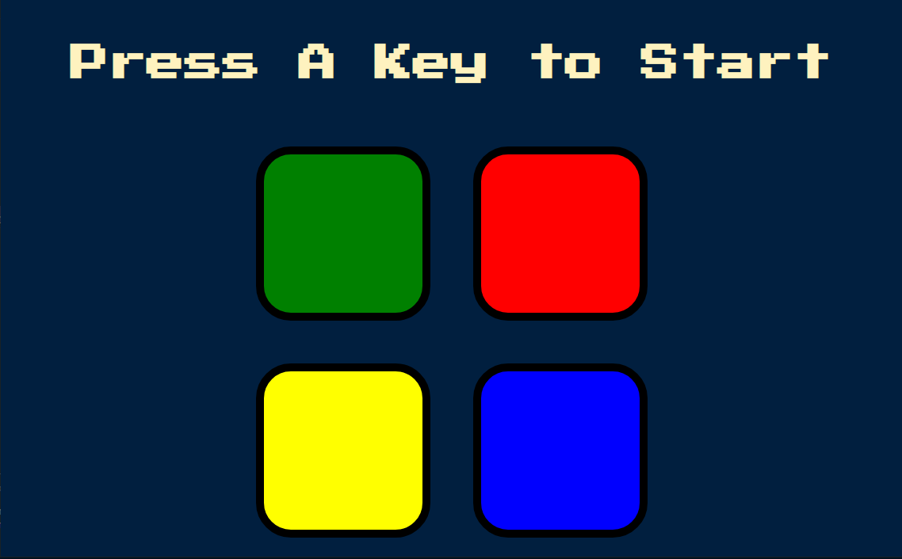
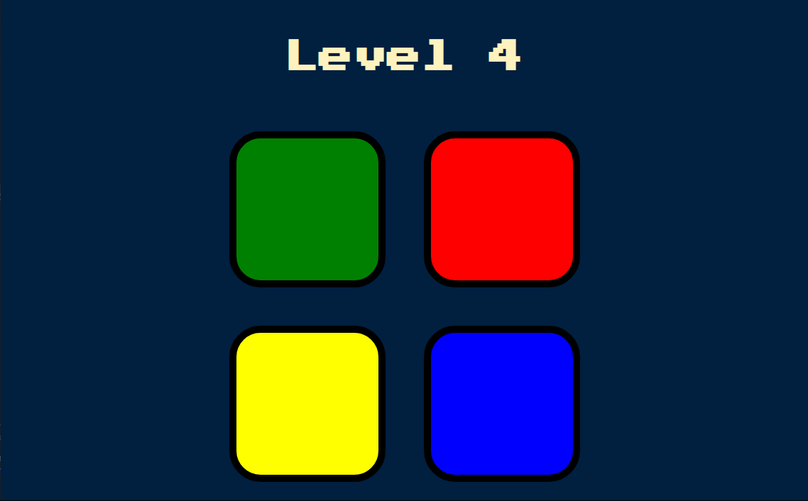
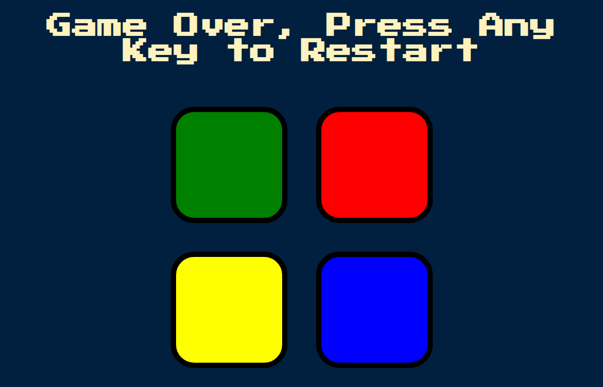
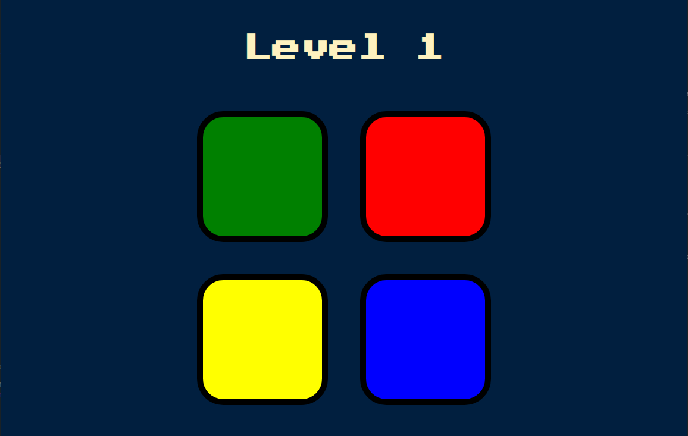

# Project Name
> A simple Simon game created with plain html and jquery.
> Live demo [_here_](https://keith-liew.github.io/Simon-Game/). 

## Table of Contents
* [General Info](#general-information)
* [Technologies Used](#technologies-used)
* [Features](#features)
* [Screenshots](#screenshots)
* [Setup](#setup)
* [Usage](#usage)
* [Project Status](#project-status)
* [Lesson Learned](#lesson-learned)
* [Acknowledgements](#acknowledgements)
* [Contact](#contact)

## General Information
- It is a practical project built for study
- It is a game that require the player to remember the sequence of the box is prompted by the machine
- Every level the machine will indicate which box is selected
- Every level the player is required to choose all boxes that are prompted in previous level in sequence and plus one current level selection.

## Technologies Used
- HTML 
- [jQuery](https://jquery.com/)

## Features
- [Simon game](https://en.wikipedia.org/wiki/Simon_(game))

## Screenshots
- Loading Screen

- In Game Screen

- Game Over Screen

- Game Restarted Screen

## Setup
- Runnable in local environment
- Internet connection for CDN to work

## Usage
- Just browse the index.html file

## Project Status
Project is: _complete_ 

## Lesson Learned
- Use jQuery instead of Javascript
- Use jQuery to interact with DOM
- Implement sound effect to the game

## Acknowledgements
- This project was inspired by Angela Yu.
- This project was based on [this course](https://www.udemy.com/course/the-complete-web-development-bootcamp/) on Udemy.

